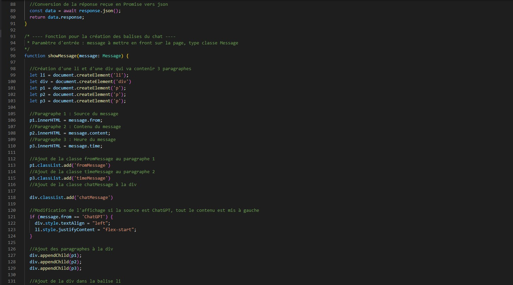

# Test technique Wikit
Objectif du test technique : faire une page Web pour discuter avec l'IA conversationnelle d'OpenAI (le fameux ChatGPT).
## Sommaire
* [Introduction](#Introduction)
* [Technologies](#Technologies)
* [Installation](#Installation)
* [Lancement](##Lancement)
* [Explication du Code](##Explication-du-Code)
* [Fonctionnalitée](#Fonctionnalitée)
* [Exemple d'utilisation](#Exemple-d'utilisation)
* [Status du projet](#Status-du-projet)
* [Commentaire et Retour](#Commentaire-et-Retour)
* [Sources](#Sources)

## Introduction
L'objectif de ce test technique était de pouvoir communiquer avec l'IA d'OpenAI (ChatGPT) via une page web.
Pour la partie front il devait y avoir :
* Un champ de saisie de message pour l'utilisateur
* Un bouton d'envoi de messages
* L'affichage de la conversation avec les messages utilisateur et les réponses de ChatGPT.
Pour la partie back, il fallait utiliser l'API REST "Chat Completion" d'OpenAI

## Technologies
* Node.js v16.14.0
* JavaScript ES2015
* TypeScript v4.9.5
* @types/node v18.14.6
* Fastify v4.14.1
* @Fastify/static v6.9.0
* Openai v3.2.1
* HTML 5 
* CSS 3

## Installation
Pour installer le projet, vous devez utiliser Node.js 
```
https://nodejs.org/en/download/
```
Recopier le dépôt git en local.
Lancez un IDE comme Visual Studio Code et dans l'onglet terminal il vous suffit d'installer les dépendances :
```
$ npm install
```
Il vous suffit maintenant de build le projet :
```
$ npm run build
```
Pour pouvoir utiliser l'application vous devez configurer votre clé d'API dans le fichier `server.js` remplacer `API_KEY` par votre clé à la ligne 10


## Lancement
Pour le lancement de l'application il vous suffit de taper la commande suivante :
```
$ npm run start
```
Le serveur est lancé sur votre port :3000, il vous suffit d'aller sur http://localhost:3000/ ou http://127.0.0.1:3000/

## Explication du Code
### Côté client
Il s'agit du fichier `app.ts` codé en TypeScript qui fait toute la partie client de l'application.
Il y a un event listener sur le bouton submit du form pour permettre d'envoyer la requête au serveur qui va récupérer la réponse de ChatGPT via l'API REST "Chat Completion" d'OpenAI





### Côté serveur
Le serveur est géré par le fichier `server.js`, il utilise Fastify comme framework serveur et Openai pour l'API


### index.html
Voici à quoi correspond l'index de la page de l'application


## Fonctionnalitée
* Possibilité de converser avec ChatGPT


## Exemple d'utilisation
L'utilisation du framework Fastify permet d'avoir des réponses rapides de l'API


## Status du projet
L'objectif du projet est terminé.
On pourrait rajouter des fonctionnalités à l'application pour la rendre plus complète.

## Commentaire et Retour
### Point de difficultés
J'ai rencontré des difficultés principalement pour la création du serveur avec fastify, je n'avais jamais utilisé ce framework. Difficulté de trouver @fastify/static pour intégrer dans ma page web

### Commentaire
J'avais déjà fait un projet similaire avec l'utilisation de socket.io. Mais j'ai toujours voulu essayer d'utiliser l'API de OpenAI et grâce à ce projet j'ai pu le tester tout en apprenant de nouvelles choses.

## Sources
* https://platform.openai.com/docs/guides/chat 
* https://platform.openai.com/docs/api-reference/chat 
* https://www.npmjs.com/package/@fastify/static
* https://www.fastify.io/
